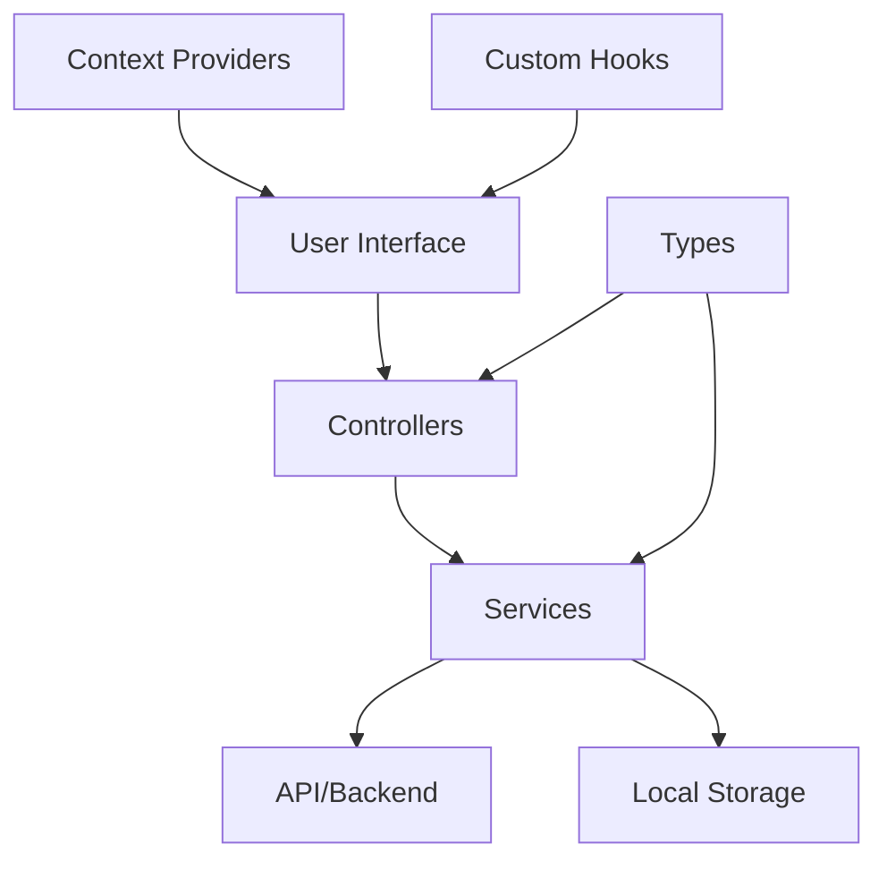

# 🌿 Tobacco Traceability System - Universitas Brawijaya

<div align="center">


**Full-stack monorepo sistem traceability tembakau dengan Frontend React + Backend API Node.js/Express**

[🚀 Quick Start](#-quick-start) • [📋 Features](#-features) • [🏗️ Architecture](#️-architecture) • [🛠️ Tech Stack](#️-tech-stack) • [📖 Documentation](#-documentation)

</div>

---

## 📖 Overview

**Tobacco Traceability System** adalah full-stack application yang dirancang untuk transparansi dan manajemen kualitas produksi tembakau. Project ini menggunakan **monorepo structure** dengan:

- **Frontend**: React 18 + TypeScript + Vite + TailwindCSS (Port 5173)
- **Backend**: Node.js + Express + Sequelize + MySQL (Port 3000)
- **Development**: Concurrently untuk run both servers dengan single command
- **Integration**: Service layer pattern dengan type mappers untuk seamless data flow

### ✅ Integration Status

- ✅ **Backend API**: Fully functional REST API dengan MySQL database
- ✅ **Service Layer**: Type-safe service layer dengan automatic data mapping
- ✅ **CRUD Operations**: Create, Read, Update, Delete untuk Master Data Petani
- ✅ **Type Safety**: TypeScript end-to-end dengan mapper functions
- ✅ **CORS**: Configured untuk cross-origin requests
- ⏳ **Testing**: UI form submission testing in progress

### 🎯 Tujuan Sistem

- **🔍 Transparansi Lengkap**: Visibilitas penuh terhadap seluruh proses produksi tembakau
- **⚡ Efisiensi Operasional**: Optimasi pengelolaan lahan, petani, dan sumber daya pertanian
- **✅ Quality Assurance**: Kontrol kualitas melalui monitoring fase tanam dan penggunaan pestisida
- **📊 Data-Driven Decisions**: Analytics dan reporting untuk pengambilan keputusan strategis
- **🤝 Stakeholder Management**: Platform terintegrasi untuk semua pemangku kepentingan

---

## 🚀 Quick Start

### Prerequisites

- Node.js >= 14.x
- npm >= 6.x
- MySQL/MariaDB >= 5.7

### Installation

```bash
# Clone repository
git clone <repository-url>
cd web-app

# Install all dependencies (frontend + backend)
npm install

# Setup database
# 1. Create MySQL database named 'mentas_tobacco_traceability'
# 2. Update backend/.env with your database credentials

# Run database migrations
npm run db:migrate

# Start both frontend & backend servers
npm run dev
```

**Access the application:**
- Frontend: http://localhost:5173
- Backend API: http://localhost:3000
- API Health Check: http://localhost:3000/health

---

## 📁 Project Structure (Monorepo)

```
web-app/
├── backend/                    # Backend API (Node.js + Express)
│   ├── src/
│   │   ├── config/            # Database configuration
│   │   ├── controllers/       # Business logic
│   │   ├── middleware/        # Validation & error handling
│   │   ├── migrations/        # Database migrations
│   │   ├── models/            # Sequelize models
│   │   ├── routes/            # API routes
│   │   └── server.js          # Express server
│   ├── .env                   # Backend config
│   ├── API_DOCUMENTATION.md   # API reference
│   └── README.md              # Backend docs
├── src/                       # Frontend React app
├── public/                    # Static assets
├── package.json               # Merged dependencies
└── MONOREPO_SETUP.md         # Monorepo guide
```

---

## ✨ Features

### 🌱 **Manajemen Pertanian Terintegrasi**
- **📅 Kalendar Tanam**: Perencanaan dan tracking jadwal tanam per musim
- **🌾 Fase Tanam Tembakau**: Monitoring detail setiap tahap pertumbuhan tanaman
- **🧪 Manajemen Pestisida**: Tracking penggunaan pestisida dan compliance
- **👥 Kelompok Tani**: Manajemen data petani dan kelompok tani
- **🌿 Varietas Tembakau**: Database komprehensif varietas tembakau

### 🗺️ **Sistem Pemetaan & Lokasi**
- **🗺️ Peta Lahan Interaktif**: Visualisasi plot lahan menggunakan Leaflet
- **📍 GPS Tracking**: Integrasi koordinat GPS untuk akurasi lokasi
- **🛣️ Aksesibilitas Jalan**: Monitoring infrastruktur akses ke lahan
- **🏢 Fasilitas Pendukung**: Pemetaan gudang, infrastruktur, dan fasilitas

### 📊 **Reporting & Analytics**
- **📈 Dashboard Analytics**: Real-time dashboard dengan visualisasi data
- **📋 Laporan Komprehensif**: Generate laporan sesuai kebutuhan
- **📊 Export Data**: Export ke berbagai format (PDF, Excel, CSV)
- **📅 Historical Data**: Tracking data historis untuk analisis trend

### ⚙️ **Manajemen Sistem**
- **👤 User Management**: Kontrol pengguna dengan role-based access
- **🔐 Hak Akses**: Sistem permission dengan tree-view interface
- **🎛️ Pengaturan Aplikasi**: Konfigurasi sistem yang fleksibel
- **🌙 Theme Management**: Dark/Light mode dengan localStorage persistence

### 🎨 **User Experience Modern**
- **🌓 Dark/Light Mode**: Theme switching dengan deteksi sistem otomatis
- **📱 Responsive Design**: Optimized untuk desktop, tablet, dan mobile
- **🚀 Performance**: Fast loading dengan lazy loading dan optimisasi
- **♿ Accessibility**: WCAG compliant untuk semua pengguna

---

## �️ Architecture

### 📁 **Struktur Proyek Lengkap**

```
tobacco-traceability-web-app/
├── � public/                       # Static assets
│   ├── 🖼️ images/                   # Image assets
│   ├── 📄 favicon.ico               # Application favicon
│   └── 📋 manifest.json             # PWA manifest
│
├── 📂 src/                          # Source code
│   ├── 📱 components/               # Reusable UI components
│   │   ├── activities/             # Agricultural activity components
│   │   ├── aksesibilitas/          # Road accessibility components
│   │   ├── approval/               # Approval workflow components
│   │   ├── dashboard/              # Dashboard dan analytics components
│   │   ├── fase-tanam/             # Planting phase management
│   │   ├── kelompok-tani/          # Farmer group management
│   │   ├── layout/                 # Layout dan navigation components
│   │   ├── map/                    # Map visualization components
│   │   ├── pestisida/              # Pesticide management components
│   │   ├── petani/                 # Farmer data components
│   │   ├── reports/                # Reporting system components
│   │   ├── settings/               # System settings components
│   │   │   ├── PenggunaContent.tsx # User management interface
│   │   │   ├── HakAksesContent.tsx # Permission management (tree-view)
│   │   │   └── AplikasiContent.tsx # Application settings
│   │   ├── traceability/           # Traceability tracking components
│   │   ├── ui/                     # Primitive UI components
│   │   │   ├── button.tsx          # Button components
│   │   │   ├── input.tsx           # Form input components
│   │   │   ├── modal.tsx           # Modal components
│   │   │   └── table.tsx           # Table components
│   │   ├── varietas/               # Tobacco variety components
│   │   ├── icons.tsx               # Icon definitions
│   │   ├── navbar.tsx              # Navigation bar
│   │   ├── theme-switch.tsx        # Theme toggle component
│   │   └── index.ts                # Component exports
│   │
│   ├── 📄 pages/                   # Page components
│   │   ├── master-data/            # Master data pages
│   │   ├── dashboard.tsx           # Main dashboard page
│   │   ├── login.tsx               # Authentication page (w/ theme support)
│   │   ├── LahanPetaPage.tsx       # Land mapping page
│   │   ├── FaseTanamPage.tsx       # Planting phase page
│   │   ├── PestisidaPage.tsx       # Pesticide management page
│   │   └── AksesibilitasPage.tsx   # Road accessibility page
│   │
│   ├── 🎮 controllers/             # Navigation dan flow controllers
│   │   └── ContentRenderer.tsx     # Main content routing controller
│   │
│   ├── 🔗 contexts/                # React Context providers
│   │   ├── ThemeContext.tsx        # Theme management context
│   │   └── AuthContext.tsx         # Authentication context
│   │
│   ├── 🪝 hooks/                   # Custom React hooks
│   │   ├── useTheme.ts             # Theme management hook
│   │   ├── useLocalStorage.ts      # Local storage hook
│   │   └── useAuth.ts              # Authentication hook
│   │
│   ├── 🏗️ layouts/                 # Layout components
│   │   ├── MainLayout.tsx          # Main application layout
│   │   └── AuthLayout.tsx          # Authentication layout
│   │
│   ├── 🔧 lib/                     # Utility libraries
│   │   ├── utils.ts                # General utilities
│   │   ├── theme.ts                # Theme utilities
│   │   └── validation.ts           # Form validation
│   │
│   ├── 🌐 services/                # API services dan data fetching
│   │   ├── api.ts                  # API client configuration
│   │   ├── auth.ts                 # Authentication services
│   │   └── data.ts                 # Data fetching services
│   │
│   ├── 🎨 styles/                  # Styling files
│   │   ├── globals.css             # Global styles
│   │   ├── index.css               # Root styles dengan Tailwind imports
│   │   └── components.css          # Component-specific styles
│   │
│   ├── 📝 types/                   # TypeScript type definitions
│   │   ├── index.ts                # Common type exports
│   │   ├── api.ts                  # API response types
│   │   ├── auth.ts                 # Authentication types
│   │   ├── components.ts           # Component prop types
│   │   └── data.ts                 # Data model types
│   │
│   ├── ⚙️ config/                  # Configuration files
│   │   ├── constants.ts            # Application constants
│   │   ├── routes.ts               # Route definitions
│   │   └── theme.ts                # Theme configuration
│   │
│   ├── 📊 data/                    # Static data dan mock data
│   │   ├── sample-data.ts          # Sample application data
│   │   └── mock-api.ts             # Mock API responses
│   │
│   ├── 🔄 provider.tsx             # Root providers wrapper
│   ├── 🚀 App.tsx                  # Main application component
│   ├── 🎯 main.tsx                 # Application entry point
│   └── 🔧 vite-env.d.ts           # Vite type definitions
│
├── 📂 docker/                      # Docker configuration
│   ├── 🐳 Dockerfile              # Production container
│   ├── 🐳 Dockerfile.dev          # Development container
│   ├── ⚙️ nginx.conf              # Nginx configuration
│   └── 🔧 docker-compose.yml       # Container orchestration
│
├── 📂 scripts/                     # Automation scripts
│   ├── 🚀 deploy.sh               # Deployment automation
│   ├── 📦 release.sh              # Release management
│   ├── 💾 backup.sh               # Backup system
│   └── 📊 monitor.sh              # Monitoring tools
│
├── 📂 docs/                        # Documentation
│   ├── 📖 README-DOCKER.md        # Docker setup guide
│   ├── 🤝 CONTRIBUTING.md         # Contribution guidelines
│   ├── 📝 CHANGELOG.md            # Version history
│   └── 🎨 BRANDING.md             # Brand guidelines
│
├── ⚙️ package.json                # Project dependencies
├── 📘 tsconfig.json               # TypeScript configuration
├── 🎨 tailwind.config.js          # Tailwind CSS configuration
├── ⚡ vite.config.ts              # Vite build configuration
├── 🔍 eslint.config.js            # ESLint configuration
├── 🌿 .env.example                # Environment variables template
└── 📄 README.md                   # Project documentation
```

### 🔄 **Data Flow Architecture**



### 🎨 **Component Architecture**

- **📱 Presentational Components**: UI components fokus pada tampilan
- **🧠 Container Components**: Components dengan business logic
- **🔗 Context Providers**: Global state management
- **🪝 Custom Hooks**: Reusable logic dan side effects
- **🎮 Controllers**: Navigation dan flow control

---

## � API Integration

### Service Layer Architecture

Sistem menggunakan **3-layer architecture** untuk frontend-backend communication:

```
UI Layer (PetaniPageNew.tsx)
      ↓
Business Logic Layer (petaniService.ts)
      ↓
HTTP Client Layer (petaniApiService.ts)
      ↓
Backend API (Express + Sequelize)
      ↓
MySQL Database
```

### Type Safety dengan Mapper Functions

Frontend dan backend menggunakan naming convention yang berbeda:
- **Frontend**: camelCase (e.g., `nama`, `statusAktif`)
- **Backend**: snake_case (e.g., `nama_lengkap`, `status`)

Mapper functions otomatis mengkonversi data:

```typescript
// Backend → Frontend
mapBackendToFrontend(backend: PetaniBackend): Petani

// Frontend → Backend  
mapFrontendToBackend(petani: Partial<Petani>): Partial<PetaniBackend>
```

### API Endpoints

| Method | Endpoint | Description |
|--------|----------|-------------|
| GET | `/api/petani` | Get all petani (with pagination) |
| GET | `/api/petani/stats` | Get statistics |
| GET | `/api/petani/:id` | Get petani by ID |
| POST | `/api/petani` | Create new petani |
| PUT | `/api/petani/:id` | Update petani |
| DELETE | `/api/petani/:id` | Delete petani |

### Example Usage

```typescript
// Get all petani
const result = await petaniService.getAllPetani({
  page: 1,
  limit: 10,
  search: 'John',
  statusAktif: true
});

// Create new petani
const newPetani = await petaniService.createPetani({
  nik: '3578123456789012',
  nama: 'John Doe',
  tanggalLahir: '1990-01-01',
  jenisKelamin: 'L',
  alamat: 'Jl. Contoh No. 123',
  // ... fields lainnya
});

// Update petani
await petaniService.updatePetani('101', {
  nama: 'John Doe Updated'
});

// Delete petani
await petaniService.deletePetani('101');
```

**📖 Detailed API Documentation**: See [INTEGRATION.md](INTEGRATION.md)

---

## �🛠️ Tech Stack

### **Frontend**
- **⚛️ React 18.0+**: Modern UI library dengan concurrent features
- **📘 TypeScript 5.0+**: Type-safe development
- **⚡ Vite 6.4+**: Lightning-fast build tool
- **🎨 Tailwind CSS 4.1+**: Utility-first CSS framework
- **🗺️ Leaflet**: Interactive maps
- **🎭 Framer Motion**: Animation library

### **Backend API**
- **� Node.js**: JavaScript runtime
- **⚡ Express 4.21+**: Web framework
- **🗄️ Sequelize 6.37+**: ORM for MySQL
- **💾 MySQL2**: Database driver
- **✅ express-validator**: Request validation
- **🔐 CORS**: Cross-origin resource sharing
- **� dotenv**: Environment configuration

### **Development Tools**
- **� ESLint 9.39+**: Code linting
- **🎨 Prettier**: Code formatting
- **🔄 nodemon**: Backend hot reload
- **⚡ concurrently**: Run multiple processes
- **📊 sequelize-cli**: Database migrations

### **Database**
- **�️ MySQL/MariaDB 5.7+**: Relational database
- **📋 Migrations**: Version control for database schema
- **� Indexes**: Optimized queries

---

## 📦 Available Scripts

### Development

```bash
# Run both frontend & backend (RECOMMENDED)
npm run dev

# Run frontend only
npm run dev:frontend

# Run backend only  
npm run dev:backend
```

### Production

```bash
# Build frontend
npm run build

# Start backend production
npm run start:backend
```

### Database

```bash
# Run migrations
npm run db:migrate

# Undo last migration
npm run db:migrate:undo

# Run seeders
npm run db:seed
```

### Testing & Quality

```bash
# Test API endpoints
npm run test:api

# Type checking
npm run type-check

# Lint code
npm run lint

# Preview production build
npm run preview
```

---

## 🚀 Quick Start

### Prerequisites
- **Node.js 18.0+** atau 20.0+ (Recommended)
- **npm 9.0+** atau **yarn 1.22+**
- **Git** untuk version control
- **Docker 24.0+** (Optional, untuk containerized deployment)

### 1. Clone Repository
```bash
git clone https://github.com/ub-tobacco-traceability/web-app.git
cd web-app
```

### 2. Install Dependencies
```bash
# Menggunakan npm (recommended)
npm install

# Atau menggunakan yarn
yarn install
```

### 3. Development Setup
```bash
# Start development server dengan hot reload
npm run dev

# Atau dengan yarn
yarn dev
```

Aplikasi akan tersedia di `http://localhost:5173`

### 4. Build untuk Production
```bash
# Build optimized production bundle
npm run build

# Preview production build locally
npm run preview
```

---

## 🐳 Docker Deployment

### 🚀 Quick Docker Start
```bash
# Development mode dengan hot reload
./deploy.sh dev

# Production build dan deployment
./deploy.sh build
./deploy.sh deploy
```

### 🔧 Docker Commands Lengkap
```bash
# System health check
./docker-check.sh

# Full production deployment
./deploy.sh deploy

# Monitoring dan logging
./monitor.sh

# Backup system data
./backup.sh

# Production release dengan versioning
./release.sh
```

### 🐳 Manual Docker Commands
```bash
# Development mode
docker-compose -f docker-compose.dev.yml up --build

# Production mode
docker-compose up --build -d

# View logs
docker-compose logs -f

# Stop containers
docker-compose down
```

Lihat [**Docker Documentation**](./README-DOCKER.md) untuk panduan deployment lengkap.

---

## 🎮 User Guide

### � **Autentikasi & Theme**
1. **Login**: Akses halaman login dengan theme toggle di pojok kanan atas
2. **Theme Mode**: Switch antara Light/Dark mode dengan auto-detection sistem
3. **Persistent Preferences**: Tema tersimpan otomatis di localStorage

### � **Dashboard Utama**
1. **Analytics Overview**: Lihat ringkasan data terbaru
2. **Quick Actions**: Akses cepat ke fitur-fitur utama
3. **Real-time Updates**: Data ter-update secara real-time

### �️ **Manajemen Peta Lahan**
1. Navigasi ke **"Lahan (Peta Lahan)"**
2. Gunakan kontrol peta untuk zoom dan navigasi
3. Klik pada plot lahan untuk detail informasi
4. Toggle layer untuk informasi berbeda

### � **Fase Tanam Tembakau**
1. Buka menu **"Fase Tanam"**
2. **Tambah Fase Baru**: Klik tombol "Tambah Tanam Baru"
3. **Update Fase**: Edit fase tanam yang sedang berjalan
4. **Monitoring**: Track progress setiap fase pertumbuhan

### 🧪 **Manajemen Pestisida**
1. Akses **"Pestisida"** dari menu utama
2. **Update Penggunaan**: Record penggunaan pestisida per plot
3. **Compliance Tracking**: Monitor kepatuhan regulasi
4. **Historical Data**: Lihat riwayat penggunaan

### 📅 **Kalender Tanam**
1. Gunakan **Kalender Tanam** untuk perencanaan
2. **Jadwal Musim**: Set jadwal tanam per musim
3. **Notifikasi**: Dapat reminder untuk aktivitas penting
4. **Koordinasi**: Sinkronisasi antar kelompok tani

### � **Sistem Reporting**
1. **Generate Laporan**: Buat laporan sesuai kebutuhan
2. **Export Data**: Download dalam format PDF, Excel, CSV
3. **Filter & Search**: Cari data dengan filter advanced
4. **Scheduled Reports**: Set laporan otomatis

### ⚙️ **Pengaturan Sistem**
1. **Manajemen Pengguna**: Control user dan role-based access
2. **Hak Akses**: Atur permission dengan tree-view interface
3. **Aplikasi Settings**: Konfigurasi pengaturan sistem
4. **Theme Preferences**: Customize tampilan aplikasi

---

## 🔧 Configuration & Environment

### 📝 Environment Variables
```bash
# .env.local
VITE_APP_TITLE="Tobacco Traceability System"
VITE_APP_VERSION="2.1.0"
VITE_MAP_DEFAULT_LAT=-7.977
VITE_MAP_DEFAULT_LNG=112.633
VITE_MAP_DEFAULT_ZOOM=13
VITE_API_BASE_URL="http://localhost:3000/api"
```

### 🎨 Theme Configuration
```typescript
// Theme system dengan localStorage persistence
const themeConfig = {
  defaultTheme: 'system',
  themes: ['light', 'dark', 'system'],
  storageKey: 'tobacco-traceability-theme'
}
```

### 🗺️ Map Configuration
```typescript
// Leaflet map configuration
const mapConfig = {
  center: [-7.977, 112.633], // Malang, Jawa Timur
  zoom: 13,
  maxZoom: 18,
  minZoom: 8
}
```

---

## 🧪 Testing & Quality Assurance

### 🔍 Testing Commands
```bash
# Run unit tests
npm run test

# Run tests dengan coverage
npm run test:coverage

# Run E2E tests
npm run test:e2e

# Lint code
npm run lint

# Fix linting issues
npm run lint:fix
```

### 📊 Code Quality
```bash
# Type checking
npm run type-check

# Bundle analysis
npm run analyze

# Performance audit
npm run audit
```

---

## � Performance & Optimization

### ⚡ Performance Features
- **🔄 Code Splitting**: Route-based automatic code splitting
- **🌳 Tree Shaking**: Eliminasi dead code otomatis
- **🖼️ Asset Optimization**: Optimisasi gambar dan font
- **📦 Bundle Compression**: Gzip compression untuk production
- **💾 Caching Strategy**: Aggressive caching untuk assets

### 📊 Performance Monitoring
```bash
# Bundle size analysis
npm run build
npm run analyze

# Performance audit
npm run audit:performance
```

### 🎯 Core Web Vitals
- **LCP (Largest Contentful Paint)**: < 2.5s
- **FID (First Input Delay)**: < 100ms
- **CLS (Cumulative Layout Shift)**: < 0.1

---

## 🚀 Deployment Options

### 1. 🌐 Static Hosting (Vercel, Netlify)
```bash
npm run build
# Upload dist/ folder atau connect Git repository
```

### 2. 🐳 Docker Container
```bash
# Production container
./deploy.sh build
./deploy.sh deploy

# Development container
./deploy.sh dev
```

### 3. ☁️ Cloud Platforms
```bash
# Vercel deployment
vercel deploy

# Railway deployment
railway deploy

# Custom cloud deployment
./release.sh
```

---

## 🔒 Security & Best Practices

### 🛡️ Security Features
- **🚫 CSP Headers**: Content Security Policy protection
- **🔐 HTTPS Ready**: SSL/TLS configuration
- **✅ Input Validation**: Form validation dan sanitization
- **🔒 Secure Headers**: Security headers dalam nginx config
- **🛡️ XSS Protection**: Cross-site scripting prevention

### 🔐 Security Best Practices
- **📝 Regular Updates**: Dependency updates otomatis
- **🔐 Environment Protection**: Secure environment variables
- **👥 Access Control**: Role-based access implementation
- **🔍 Security Scanning**: Automated vulnerability scanning

---

## � Monitoring & Analytics

### 📈 Monitoring Tools
```bash
# Application health monitoring
./monitor.sh

# System resource monitoring
docker stats

# Log monitoring
docker-compose logs -f --tail=100

# Backup system
./backup.sh
```

### 📊 Analytics Dashboard
- **📈 User Analytics**: User behavior tracking
- **⚡ Performance Metrics**: Application performance monitoring
- **🔧 System Health**: Infrastructure monitoring
- **📊 Business Metrics**: Agricultural data analytics

---

## 🤝 Contributing

### 👥 Development Team
- **Frontend Development**: React TypeScript specialist
- **UI/UX Design**: Modern interface design dengan accessibility focus
- **DevOps & Infrastructure**: Docker containerization dan deployment
- **Agricultural Domain Expert**: Tobacco farming dan traceability specialist

### 🔄 Development Workflow
1. **Fork** repository ke akun personal
2. **Clone** forked repository ke local machine
3. **Create feature branch** (`git checkout -b feature/AmazingFeature`)
4. **Make changes** dengan mengikuti code standards
5. **Commit changes** (`git commit -m 'Add some AmazingFeature'`)
6. **Push to branch** (`git push origin feature/AmazingFeature`)
7. **Open Pull Request** dengan deskripsi yang jelas

### 📝 Code Standards
- **TypeScript Strict Mode**: Type safety untuk semua code
- **ESLint Configuration**: Automated code quality checking
- **Prettier Formatting**: Consistent code formatting
- **Conventional Commits**: Structured commit messages
- **Component Documentation**: JSDoc untuk semua components

### 🔍 Pull Request Guidelines
- **Clear Description**: Deskripsi lengkap tentang perubahan
- **Unit Tests**: Test coverage untuk fitur baru
- **Documentation**: Update dokumentasi jika diperlukan
- **Performance Impact**: Assessment impact terhadap performance
- **Screenshots**: Screenshot untuk perubahan UI

### 🐛 Bug Reports
Gunakan GitHub Issues dengan template:
- **Bug Description**: Deskripsi detail bug
- **Steps to Reproduce**: Langkah-langkah reproduksi
- **Expected Behavior**: Behavior yang diharapkan
- **Screenshots**: Screenshot atau video jika relevan
- **Environment**: Browser, OS, device information

---

## 📚 Documentation

### 📖 **Available Documentation**
- **[README.md](./README.md)**: Overview dan quick start guide
- **[README-DOCKER.md](./README-DOCKER.md)**: Docker deployment guide
- **[CONTRIBUTING.md](./CONTRIBUTING.md)**: Contribution guidelines
- **[CHANGELOG.md](./CHANGELOG.md)**: Version history dan changes
- **[BRANDING.md](./BRANDING.md)**: Brand guidelines dan assets
- **[DOCKER.md](./DOCKER.md)**: Detailed Docker setup

### 🔗 **API Documentation**
- **REST API**: Backend API documentation
- **Component API**: React component props dan usage
- **Type Definitions**: TypeScript interfaces dan types
- **Hook Usage**: Custom hooks documentation

### 📊 **Architecture Documentation**
- **System Architecture**: High-level system design
- **Component Architecture**: Frontend component structure
- **Data Flow**: Data management dan state flow
- **Security Architecture**: Security implementation details

---

## 📝 Changelog

### 🆕 **Version 2.1.0** (September 2025)
#### ✨ **New Features**
- **🌙 Advanced Theme System**: Dark/Light mode dengan localStorage persistence
- **🎨 Modern Login Page**: Glass morphism design dengan theme optimization
- **⚙️ Settings Management**: Comprehensive settings dengan tree-view permissions
- **📊 Enhanced Dashboard**: Real-time analytics dan improved visualizations
- **🗺️ Map Improvements**: Better performance dan user experience
- **📱 Mobile Optimization**: Enhanced responsive design

#### 🔧 **Improvements**
- **Performance**: 40% faster initial load time
- **Accessibility**: WCAG 2.1 AA compliance
- **TypeScript**: Strict mode implementation
- **Bundle Size**: 25% reduction dalam bundle size
- **Security**: Enhanced security headers dan CSP

#### 🐛 **Bug Fixes**
- Fixed theme switching persistence
- Resolved mobile navigation issues
- Fixed map rendering pada Safari
- Improved form validation feedback

### 📋 **Version 2.0.0** (August 2025)
- **🏗️ Architecture Redesign**: Complete frontend architecture overhaul
- **🎨 UI/UX Modernization**: Modern design system implementation
- **🧩 Component Library**: Custom component library development
- **🔐 Authentication**: Secure authentication system
- **📊 Reporting System**: Advanced reporting dan analytics

---

## 📄 License

```
MIT License

Copyright (c) 2025 Universitas Brawijaya - Tobacco Traceability System

Permission is hereby granted, free of charge, to any person obtaining a copy
of this software and associated documentation files (the "Software"), to deal
in the Software without restriction, including without limitation the rights
to use, copy, modify, merge, publish, distribute, sublicense, and/or sell
copies of the Software, and to permit persons to whom the Software is
furnished to do so, subject to the following conditions:

The above copyright notice and this permission notice shall be included in all
copies or substantial portions of the Software.

THE SOFTWARE IS PROVIDED "AS IS", WITHOUT WARRANTY OF ANY KIND, EXPRESS OR
IMPLIED, INCLUDING BUT NOT LIMITED TO THE WARRANTIES OF MERCHANTABILITY,
FITNESS FOR A PARTICULAR PURPOSE AND NONINFRINGEMENT. IN NO EVENT SHALL THE
AUTHORS OR COPYRIGHT HOLDERS BE LIABLE FOR ANY CLAIM, DAMAGES OR OTHER
LIABILITY, WHETHER IN AN ACTION OF CONTRACT, TORT OR OTHERWISE, ARISING FROM,
OUT OF OR IN CONNECTION WITH THE SOFTWARE OR THE USE OR OTHER DEALINGS IN THE
SOFTWARE.
```

---

## 🙏 Acknowledgments

### 🏛️ **Institutional Support**
- **Universitas Brawijaya**: Research institution dan academic support
- **Faculty of Agriculture**: Domain expertise dan research collaboration
- **IT Department**: Infrastructure support dan technical guidance

### 🛠️ **Technology Stack**
- **React Team**: Untuk fantastic UI library
- **TypeScript Team**: Untuk robust type system
- **Tailwind CSS**: Untuk modern styling framework
- **Leaflet**: Untuk powerful mapping capabilities
- **Vite Team**: Untuk lightning-fast build tool

### 🌿 **Agricultural Experts**
- **Tobacco Farming Community**: Domain knowledge dan real-world insights
- **Agricultural Extension Officers**: Practical experience dan validation
- **Research Collaborators**: Academic research dan methodology

### 💡 **Open Source Community**
- **Contributors**: All developers yang berkontribusi pada project
- **Issue Reporters**: Users yang membantu improve application
- **Documentation Writers**: Contributors untuk documentation improvements

---

## 📞 Support & Contact

### 🆘 **Getting Help**
- **📖 Documentation**: Check comprehensive documentation first
- **❓ GitHub Issues**: Create issue untuk bugs atau feature requests
- **💬 Discussions**: Use GitHub Discussions untuk questions
- **📧 Email Support**: Contact development team directly

### 🌐 **Links & Resources**
- **🔗 Repository**: [GitHub Repository](https://github.com/ub-tobacco-traceability/web-app)
- **📊 Demo**: [Live Demo](https://tobacco-traceability.vercel.app)
- **📚 Documentation**: [Full Documentation](https://docs.tobacco-traceability.com)
- **🏛️ Institution**: [Universitas Brawijaya](https://ub.ac.id)

### 👨‍💻 **Development Team**
- **Project Lead**: Agricultural Technology Research Team
- **Frontend Developer**: React TypeScript Specialist
- **UI/UX Designer**: Modern Interface Design Expert
- **DevOps Engineer**: Deployment dan Infrastructure Specialist

---

<div align="center">

**🌿 Tobacco Traceability System - Universitas Brawijaya**

**Supporting transparency and quality in Indonesia's tobacco industry**

[](https://github.com/ub-tobacco-traceability/web-app)
[](https://github.com/ub-tobacco-traceability/web-app/fork)
[](https://github.com/ub-tobacco-traceability/web-app)

Made with ❤️ by [Universitas Brawijaya](https://ub.ac.id) • [🌟 Give us a star!](https://github.com/ub-tobacco-traceability/web-app)

</div>

## 🐛 Troubleshooting

### Common Issues

#### Theme Toggle Not Working
```bash
# Check localStorage persistence
localStorage.getItem('theme')

# Clear theme data
localStorage.removeItem('theme')
```

#### Map Not Loading
```bash
# Check Leaflet CSS import
# Verify coordinate format
# Check network connectivity
```

#### Docker Issues
```bash
# Check Docker daemon
./docker-check.sh

# Clean rebuild
./deploy.sh clean
./deploy.sh build
```

### Getting Help
- 📖 Check [Documentation](./DOCKER.md)
- 🐛 Report [Issues](https://github.com/your-username/tobacco-traceability/issues)
- 💬 Join [Discussions](https://github.com/your-username/tobacco-traceability/discussions)

---

## 📝 Changelog

### Version 1.0.0 (September 2025)
- ✨ Initial release
- 🗺️ Interactive land mapping dengan Leaflet
- 🌱 Comprehensive farming phase management
- 🛣️ Road accessibility master data
- 🎨 Dark/Light theme support
- 🐳 Complete Docker containerization
- 📊 Monitoring dan backup systems

---

## 📄 License

This project is licensed under the MIT License - see the [LICENSE](LICENSE) file for details.

---

## 👥 Team

### Core Contributors
- **Lead Developer**: [Arief Andriyan SM](https://github.com/ariefandriyan)
- **UI/UX Designer**: [Arief Andriyan SM](https://github.com/ariefandriyan)
- **DevOps Engineer**: [Arief Andriyan SM](https://github.com/ariefandriyan)

### Acknowledgments
- Indonesian tobacco farmers untuk insights dan requirements
- Open source community untuk amazing tools dan libraries
- [Leaflet](https://leafletjs.com/) untuk mapping capabilities
- [HeroUI](https://heroui.com/) untuk beautiful components

---

## 🌟 Support

If you found this project helpful, please give it a ⭐️!

### Sponsor
Support the development of this project:
- ☕ [Buy me a coffee](https://buymeacoffee.com/your-username)
- 💝 [GitHub Sponsors](https://github.com/sponsors/your-username)

---

<div align="center">

**Made with ❤️ for Indonesian tobacco farmers**

[🏠 Home](https://your-domain.com) • [📧 Contact](mailto:your-email@domain.com) • [🐦 Twitter](https://twitter.com/your-username)

</div>
